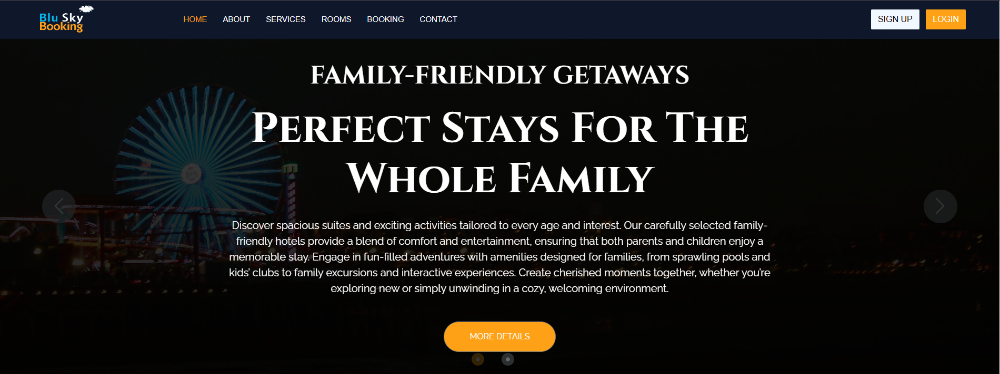
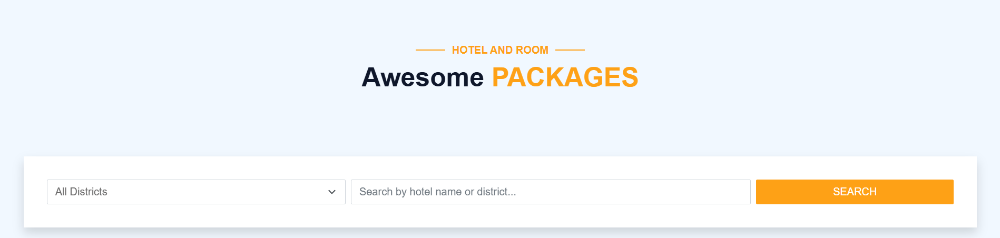
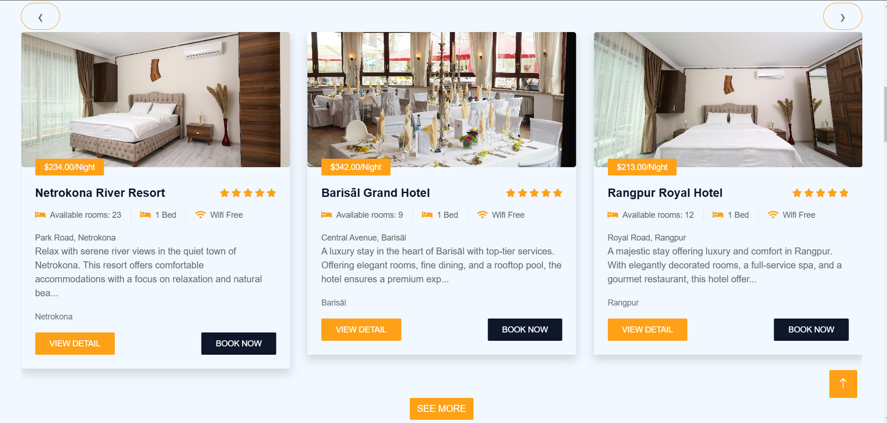
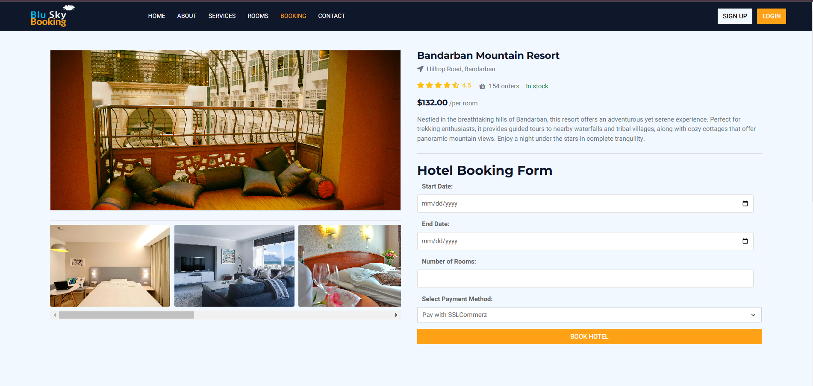
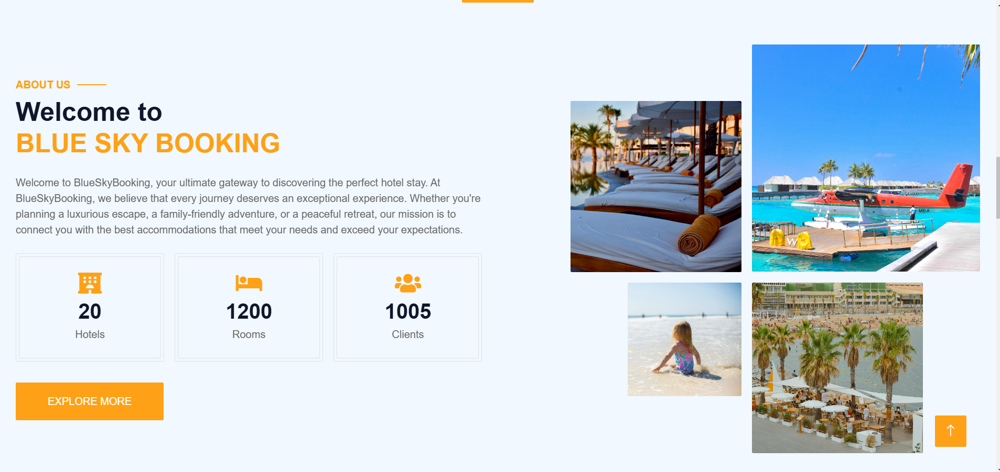
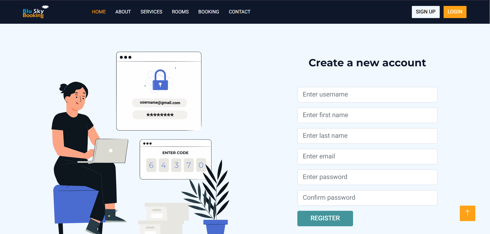
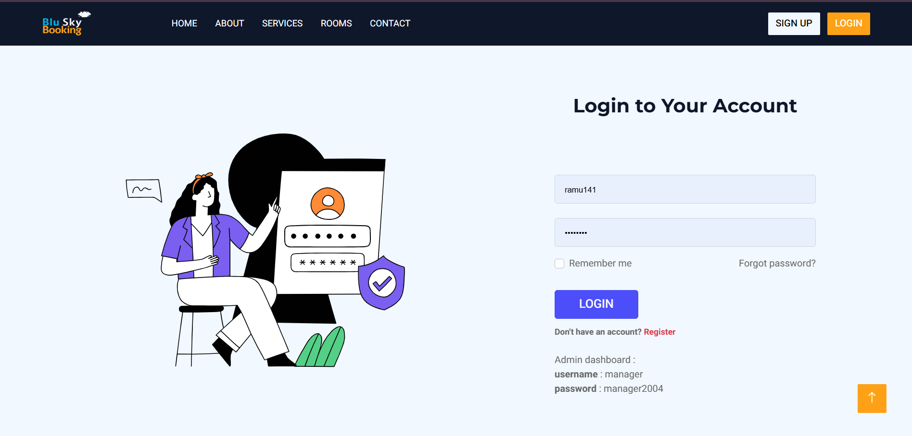
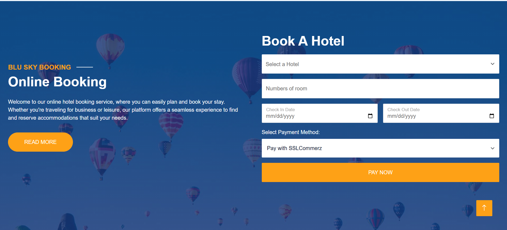
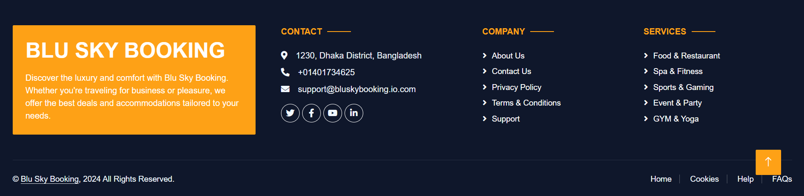

# Blue Sky Booking

[Blue Sky Booking](#) is a dynamic and responsive hotel booking platform, designed to provide a seamless and engaging user experience for finding and booking accommodations. This `full-stack` application combines the power of `Django REST Framework` for the backend with a modern frontend built using `HTML`, `CSS`, `Bootstrap 5`, and `JavaScript`. The platform is deployed with the backend on Render and the frontend on `Netlify`, ensuring robust and scalable performance.

## Key Features

- **User Account Management**: Users can easily register for new accounts and log in and out securely.
- **User Deposits**: Manage `deposits` effectively to ensure seamless booking transactions.
- **Hotel Search and Discovery**: Find and explore hotels by `district name or hotel name`, with detailed views of hotels listed in specific districts.
- **Booking and Payment**: A straightforward booking process with automatic `email` confirmations. Users receive detailed receipts for bookings and deposits, with options to download receipts as `PDFs`.
- **Client Reviews**: View hotel reviews from other users and contribute by `submitting` your reviews after booking.
- **Dynamic and Responsive Design**: The user interface is built to be dynamic and highly `responsive`, adapting smoothly to different devices and screen sizes for an optimal user experience.
- **Modern UI**: Leveraging Bootstrap 5, the platform features a sleek and contemporary design, ensuring a visually appealing and intuitive user interface.
- **Admin Role Management**: Admins can manage `roles`, add or delete districts, add, delete, or edit hotels, delete users and reviews, and view a dashboard with hotel overviews and booking lists.
- **Payment Gateway Integration**: Secure and reliable `payment` processing through `SSLCommerz`, ensuring smooth and safe transactions for bookings and deposits.

## Technologies Used

- **Backend**: Developed using `Django REST Framework` with `PostgreSQL` as the database, hosted on `Render` for scalable and secure backend operations.
- **Frontend**: Crafted with `HTML`, `CSS`, `Bootstrap 5`, and `JavaScript`, ensuring a dynamic and responsive user interface.
- **Email Notifications**: Automated email notifications for `deposits, login, registration, and booking confirmations` enhance user engagement and provide important updates.
- **PDF Generation**: Users can `download` their booking receipts in `PDF format`, offering convenient documentation and record-keeping.
- **Dynamic Content**: The platform supports `dynamic` updates and real-time interactions, providing a smooth and engaging user experience.

## Repositories

- **Frontend Repository**: [Blue Sky Booking Frontend](https://github.com/ramim141/Hotel-Booking-Management-frontend)
- **Backend Repository**: [Blue Sky Booking Backend](https://github.com/ramim141/Hotel-Booking-Management-Backend)

### Project frontend Screenshots
### 1. Homepage and Navbar 

### 2. Search and Filter section

### 3. Services 

### 4. Room Details

### 5. About Us

### 6. Signup

### 7.Log in

### 8. Booking section

### 9. Promotion section

### 10. Footer

---

**Blue Sky Booking** - Revolutionizing the way you book hotels.
